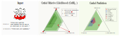

# Credal Prediction based on Relative Likelihood
Predictions in the form of sets of probability distributions, so-called credal sets, provide a suitable means to represent a learner's epistemic uncertainty. 
In this paper, we propose a theoretically grounded approach to credal prediction based on the statistical notion of relative likelihood: The target of prediction is the set of all (conditional) probability distributions produced by the collection of plausible models, namely those models whose relative likelihood exceeds a specified threshold. 
This threshold has an intuitive interpretation and allows for controlling the trade-off between correctness and precision of credal predictions. 
We tackle the problem of approximating credal sets defined in this way by means of suitably modified ensemble learning techniques. 
To validate our approach, we illustrate its effectiveness by experiments on benchmark datasets demonstrating superior uncertainty representation without compromising predictive performance. 
We also compare our method against several state-of-the-art baselines in credal prediction.

<div align="center">
  
</div>

## Setup
The code is implemented in Python 3.10. The dependencies are listed in the `requirements.txt` file and can be installed using:
```bash
pip install -r requirements.txt
```

## Usage
The models for our method are trained using the `train.py` script. 
The baselines are trained using the `train_baselines.py` script.
The hyperparameters can be found in the respective scripts and are passed as arguments.
Example usage:
```bash
python3 train.py \
            --dataset cifar10 \
            --validate False \
            --classes 10 \
            --model resnet \
            --n_members 20 \
            --optimizer sgd \
            --epochs 200 \
            --lr 0.1 \
            --wd 5e-4 \
            --tobias 100 \
            --seed $sd \
            --batch False
```

